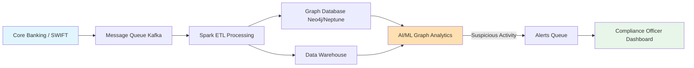
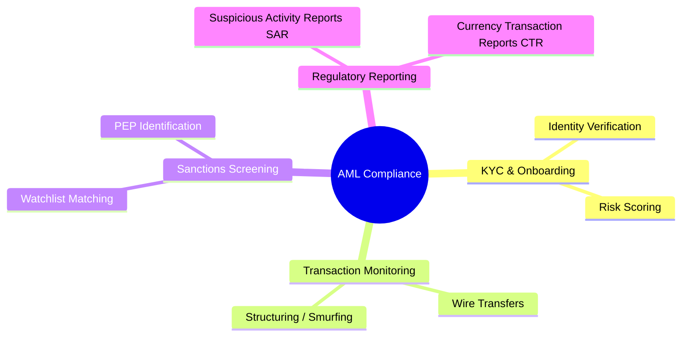
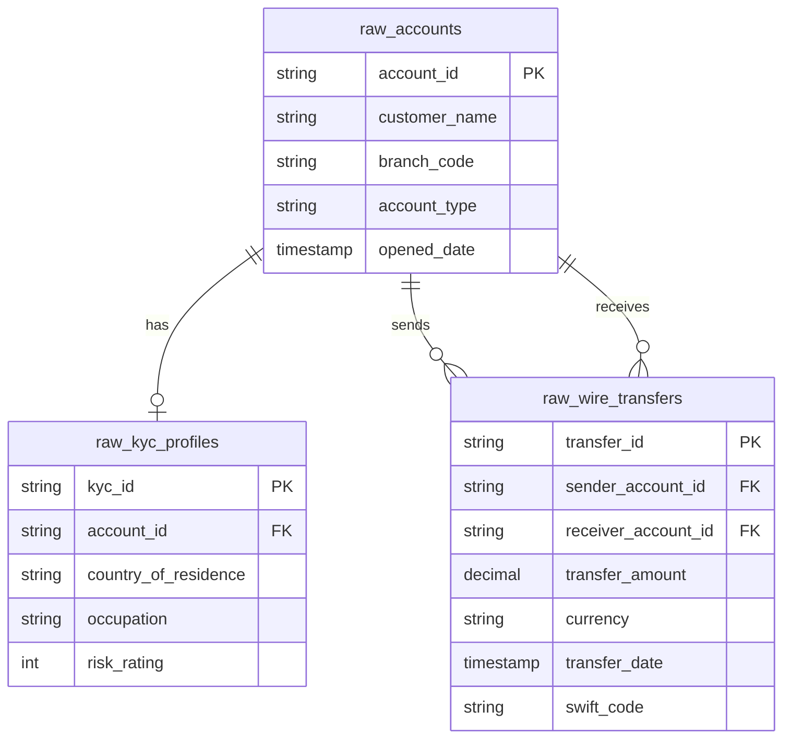
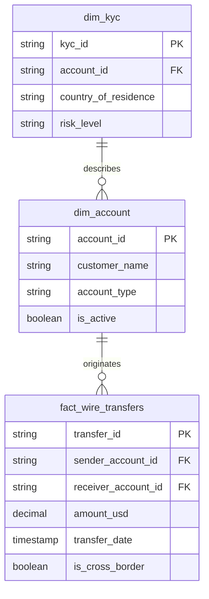

# 🛡️ Finance Banking: Anti-Money Laundering (AML)

[🏠 Back to Home](../readme.md)

## 📌 Common List of IT Projects in Finance Banking

**Why**: Banks are required by law to monitor customer transactions to prevent money laundering and terrorist financing. Failing to do so results in multi-billion dollar fines and severe reputational damage.
**What**: Building an Anti-Money Laundering (AML) and Know Your Customer (KYC) compliance platform to track, analyze, and flag suspicious wire transfers and account activities.
**How**: Leveraging Big Data pipelines (Spark), Graph Databases (to detect money trails), Web Development (Compliance Officer portals), and AI/ML (Graph Neural Networks and anomaly detection).

### 🔄 High-Level Banking Architecture Flow


### 🛡️ Finance IT Projects Mind Map (AML Focus)


### 🛡️ Project: Anti-Money Laundering (AML) Transaction Monitoring System

#### ⚙️ IT Data Engineering Project
**Project Process Flow:**
1. Ingest raw account data, KYC profiles, and domestic/international wire transfers from core systems.
2. Cleanse and standardize data using Apache Spark (Silver layer).
3. Load relational data into a Data Warehouse (Gold layer) for BI reporting.
4. Simultaneously load transactional relationships into a Graph Database (Nodes = Accounts, Edges = Transfers) to map out complex money trails.

**Tasks & Objectives:**
- **Objective**: Build a robust, daily batch and near-real-time pipeline to integrate disparate banking systems for holistic compliance monitoring.
- **Tasks**: Create ETL scripts to map source SWIFT messages to internal schemas, load graph structures, and implement data quality checks for missing sender/receiver information.

**Source Data Model (OLTP / Raw Systems):**
- `raw_accounts`: Customer bank accounts.
- `raw_kyc_profiles`: Customer identity and risk profiles.
- `raw_wire_transfers`: High-value money movements between accounts.

**Target Data Model (OLAP / Star Schema):**
- **Dimensions**: `dim_account`, `dim_kyc`
- **Fact**: `fact_wire_transfers`

**Source Systems ER Diagram:**


**Target Data Warehouse ER Diagram:**


**DDLs:**
```sql
-- =========================================
-- SOURCE TABLES (Bronze Layer / Raw Data)
-- =========================================
CREATE TABLE raw_accounts (
    account_id VARCHAR(50) PRIMARY KEY,
    customer_name VARCHAR(100),
    branch_code VARCHAR(20),
    account_type VARCHAR(50),
    opened_date TIMESTAMP
);

CREATE TABLE raw_kyc_profiles (
    kyc_id VARCHAR(50) PRIMARY KEY,
    account_id VARCHAR(50),
    country_of_residence VARCHAR(50),
    occupation VARCHAR(100),
    risk_rating INT
);

CREATE TABLE raw_wire_transfers (
    transfer_id VARCHAR(100) PRIMARY KEY,
    sender_account_id VARCHAR(50),
    receiver_account_id VARCHAR(50),
    transfer_amount DECIMAL(15, 2),
    currency VARCHAR(3),
    transfer_date TIMESTAMP,
    swift_code VARCHAR(20)
);

-- =========================================
-- TARGET TABLES (Gold Layer / Star Schema)
-- =========================================
CREATE TABLE dim_account (
    account_id VARCHAR(50) PRIMARY KEY,
    customer_name VARCHAR(100),
    account_type VARCHAR(50),
    is_active BOOLEAN
);

CREATE TABLE dim_kyc (
    kyc_id VARCHAR(50) PRIMARY KEY,
    account_id VARCHAR(50) REFERENCES dim_account(account_id),
    country_of_residence VARCHAR(50),
    risk_level VARCHAR(20)
);

CREATE TABLE fact_wire_transfers (
    transfer_id VARCHAR(100) PRIMARY KEY,
    sender_account_id VARCHAR(50) REFERENCES dim_account(account_id),
    receiver_account_id VARCHAR(50) REFERENCES dim_account(account_id),
    amount_usd DECIMAL(15, 2),
    transfer_date TIMESTAMP,
    is_cross_border BOOLEAN
);
```

**Source Data Generators (Python):**
*Note: This script generates mock data for the Source tables, including accounts, KYC profiles, and wire transfers.*
```python
import csv
import random
from faker import Faker
from datetime import datetime, timedelta

fake = Faker()

def generate_aml_source_data(num_accounts=100, num_transfers=2000):
    accounts = []
    
    # 1. Generate raw_accounts.csv and raw_kyc_profiles.csv
    with open('raw_accounts.csv', mode='w', newline='') as f_acc, \
         open('raw_kyc_profiles.csv', mode='w', newline='') as f_kyc:
        
        acc_writer = csv.writer(f_acc)
        kyc_writer = csv.writer(f_kyc)
        
        acc_writer.writerow(['account_id', 'customer_name', 'branch_code', 'account_type', 'opened_date'])
        kyc_writer.writerow(['kyc_id', 'account_id', 'country_of_residence', 'occupation', 'risk_rating'])
        
        for _ in range(num_accounts):
            acc_id = fake.iban()
            accounts.append(acc_id)
            opened_date = fake.date_time_between(start_date='-5y', end_date='now')
            
            acc_writer.writerow([acc_id, fake.name(), fake.bban(), random.choice(['Checking', 'Savings', 'Corporate']), opened_date.strftime('%Y-%m-%d')])
            kyc_writer.writerow([fake.uuid4(), acc_id, fake.country(), fake.job(), random.randint(1, 100)])

    # 2. Generate raw_wire_transfers.csv
    with open('raw_wire_transfers.csv', mode='w', newline='') as f_trans:
        trans_writer = csv.writer(f_trans)
        trans_writer.writerow(['transfer_id', 'sender_account_id', 'receiver_account_id', 'transfer_amount', 'currency', 'transfer_date', 'swift_code'])
        
        for _ in range(num_transfers):
            transfer_id = fake.uuid4()
            sender = random.choice(accounts)
            receiver = random.choice(accounts)
            while receiver == sender:
                receiver = random.choice(accounts)
                
            amount = round(random.uniform(100.0, 500000.0), 2)
            currency = random.choice(['USD', 'EUR', 'GBP', 'JPY'])
            transfer_date = fake.date_time_between(start_date='-1y', end_date='now')
            
            trans_writer.writerow([transfer_id, sender, receiver, amount, currency, transfer_date.strftime('%Y-%m-%d %H:%M:%S'), fake.swift()])

if __name__ == "__main__":
    generate_aml_source_data(100, 1500)
    print("Generated raw_accounts.csv, raw_kyc_profiles.csv, and raw_wire_transfers.csv successfully.")
```

#### 🌐 IT Web Development
**Project Process Flow:**
1. Compliance Officer logs into a secure investigative portal (React/Angular).
2. The dashboard displays a prioritized queue of alerts flagged by the ML models.
3. The officer uses a visual graph explorer (e.g., Cytoscape.js) to view the "money trail" network between multiple accounts.
4. The officer documents their findings and submits a SAR (Suspicious Activity Report) directly to regulatory bodies via an API.

**Tasks & Objectives:**
- **Objective**: Create an intuitive, highly secure portal that simplifies the investigation of complex financial networks.
- **Tasks**: Implement interactive network graph UI components, build automated reporting pipelines (PDF generation), and ensure strict audit logging of user actions.

#### 🤖 IT AI ML
**Tasks & Objectives:**
- **Objective**: Identify sophisticated money laundering patterns (like "smurfing" or circular transfers) that rule-based systems miss.
- **Tasks**: Apply Graph Analytics (e.g., PageRank, Connected Components) to identify central hubs in money movement. Train unsupervised anomaly detection models (Isolation Forests, Autoencoders) on account behaviors to spot sudden deviations from a user's normal baseline.
