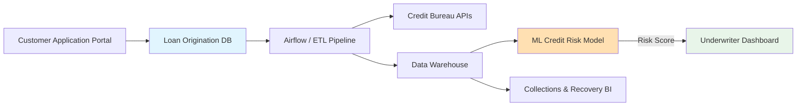
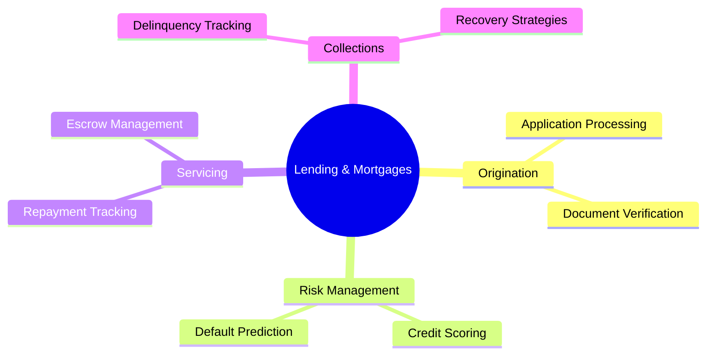
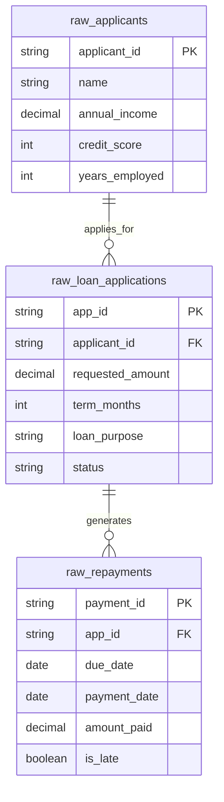

# 🏠 Finance Banking: Lending and Mortgages

[🏠 Back to Home](../readme.md)

## 📌 Common List of IT Projects in Finance Banking

**Why**: Lending is the primary revenue engine for commercial banks. Accurately assessing borrower risk and managing the loan lifecycle efficiently is critical for profitability and risk mitigation.
**What**: Developing Loan Origination Systems (LOS), credit risk scoring engines, and repayment tracking data platforms.
**How**: Using ETL pipelines to consolidate credit bureau data, Web Portals for loan underwriters, and Machine Learning models to predict the probability of default.

### 🔄 High-Level Banking Architecture Flow


### 🏠 Finance IT Projects Mind Map (Lending Focus)


### 🏠 Project: Loan Origination and Risk Scoring Platform

#### ⚙️ IT Data Engineering Project
**Project Process Flow:**
1. Extract raw loan applications and historical repayment data from the core lending databases.
2. Integrate third-party data via APIs (e.g., Equifax, Experian credit scores) in the staging area.
3. Transform and model the data to support risk analysis and regulatory reporting (e.g., Basel III compliance).

**Tasks & Objectives:**
- **Objective**: Build a comprehensive data pipeline that unifies applicant data with external credit metrics to support underwriting decisions.
- **Tasks**: Orchestrate complex batch jobs using Apache Airflow, create data quality rules to flag incomplete applications, and design a Star Schema optimized for historical cohort analysis.

**Source Data Model (OLTP / Raw Systems):**
- `raw_applicants`: Borrower details (income, employment).
- `raw_loan_applications`: Requested loan details and statuses.
- `raw_repayments`: Historical payment schedules and actual payments made.

**Target Data Model (OLAP / Star Schema):**
- **Dimensions**: `dim_borrower`, `dim_loan_product`
- **Fact**: `fact_loan_applications`, `fact_repayments`

**Source Systems ER Diagram:**


**DDLs:**
```sql
-- =========================================
-- SOURCE TABLES (Bronze Layer / Raw Data)
-- =========================================
CREATE TABLE raw_applicants (
    applicant_id VARCHAR(50) PRIMARY KEY,
    name VARCHAR(100),
    annual_income DECIMAL(15, 2),
    credit_score INT,
    years_employed INT
);

CREATE TABLE raw_loan_applications (
    app_id VARCHAR(50) PRIMARY KEY,
    applicant_id VARCHAR(50),
    requested_amount DECIMAL(15, 2),
    term_months INT,
    loan_purpose VARCHAR(50),
    status VARCHAR(20)
);

CREATE TABLE raw_repayments (
    payment_id VARCHAR(50) PRIMARY KEY,
    app_id VARCHAR(50),
    due_date DATE,
    payment_date DATE,
    amount_paid DECIMAL(15, 2),
    is_late BOOLEAN
);

-- =========================================
-- TARGET TABLES (Gold Layer / Star Schema)
-- =========================================
CREATE TABLE dim_borrower (
    borrower_sk INT AUTO_INCREMENT PRIMARY KEY,
    applicant_id VARCHAR(50),
    income_bracket VARCHAR(20),
    credit_tier VARCHAR(20)
);

CREATE TABLE fact_loan_applications (
    app_id VARCHAR(50) PRIMARY KEY,
    borrower_sk INT REFERENCES dim_borrower(borrower_sk),
    requested_amount DECIMAL(15, 2),
    approved_amount DECIMAL(15, 2),
    approval_status VARCHAR(20),
    application_date DATE
);
```

**Source Data Generators (Python):**
```python
import csv
import random
from faker import Faker
from datetime import datetime, timedelta

fake = Faker()

def generate_lending_data(num_applicants=100):
    apps = []
    
    with open('raw_applicants.csv', mode='w', newline='') as f_app:
        writer = csv.writer(f_app)
        writer.writerow(['applicant_id', 'name', 'annual_income', 'credit_score', 'years_employed'])
        for _ in range(num_applicants):
            app_id = fake.uuid4()
            apps.append(app_id)
            writer.writerow([app_id, fake.name(), round(random.uniform(30000, 250000), 2), random.randint(500, 850), random.randint(0, 30)])

    loan_apps = []
    with open('raw_loan_applications.csv', mode='w', newline='') as f_loan:
        writer = csv.writer(f_loan)
        writer.writerow(['app_id', 'applicant_id', 'requested_amount', 'term_months', 'loan_purpose', 'status'])
        for app_id in apps:
            # Some users apply for multiple loans
            for _ in range(random.randint(1, 2)):
                loan_id = fake.uuid4()
                status = random.choice(['APPROVED', 'REJECTED', 'PENDING', 'ACTIVE', 'DEFAULTED'])
                loan_apps.append((loan_id, status))
                purpose = random.choice(['Mortgage', 'Auto', 'Personal', 'Debt Consolidation'])
                writer.writerow([loan_id, app_id, round(random.uniform(5000, 500000), 2), random.choice([12, 36, 60, 360]), purpose, status])

    with open('raw_repayments.csv', mode='w', newline='') as f_rep:
        writer = csv.writer(f_rep)
        writer.writerow(['payment_id', 'app_id', 'due_date', 'payment_date', 'amount_paid', 'is_late'])
        
        for loan_id, status in loan_apps:
            if status in ['APPROVED', 'ACTIVE', 'DEFAULTED']:
                start_date = fake.date_this_decade()
                # Generate 1 to 12 payments
                for i in range(random.randint(1, 12)):
                    due_date = start_date + timedelta(days=30*i)
                    is_late = random.random() > 0.85 or status == 'DEFAULTED'
                    payment_date = due_date + timedelta(days=random.randint(5, 45)) if is_late else due_date - timedelta(days=random.randint(1, 5))
                    amt = round(random.uniform(200, 2000), 2)
                    
                    writer.writerow([fake.uuid4(), loan_id, due_date.strftime('%Y-%m-%d'), payment_date.strftime('%Y-%m-%d'), amt, is_late])

if __name__ == "__main__":
    generate_lending_data(150)
    print("Generated raw_applicants.csv, raw_loan_applications.csv, and raw_repayments.csv successfully.")
```

#### 🌐 IT Web Development
**Project Process Flow:**
1. Underwriter logs into the Loan Origination Portal (Vue.js / FastAPI).
2. The portal pulls up pending applications, combining form data with external API data (Credit Bureau checks).
3. Underwriter views a dashboard detailing Debt-to-Income (DTI) ratios and machine learning risk flags.
4. Underwriter approves/rejects the loan and generates automated notification emails to the customer.

**Tasks & Objectives:**
- **Objective**: Streamline the manual review process for underwriters to decrease loan origination time.
- **Tasks**: Build internal workflow engines (state machines), integrate third-party REST APIs for real-time document verification, and generate PDF loan agreements dynamically.

#### 🤖 IT AI ML
**Tasks & Objectives:**
- **Objective**: Predict the Probability of Default (PD) to determine application approval and optimal interest rates.
- **Tasks**: Train binary classification models (e.g., Logistic Regression for explainability, LightGBM for accuracy) on historical borrower data and macroeconomic indicators. Use ML to identify applicants likely to default within the first 12 months.
