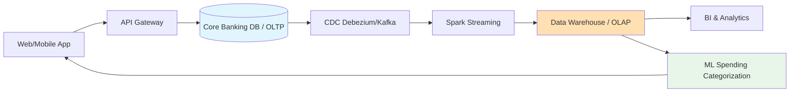
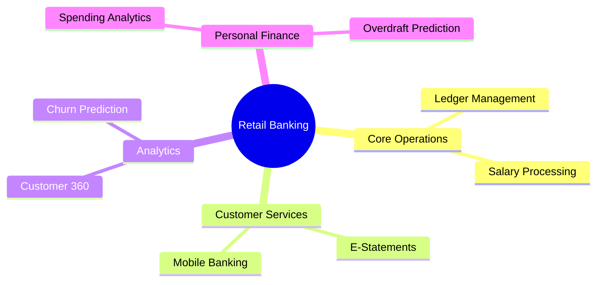
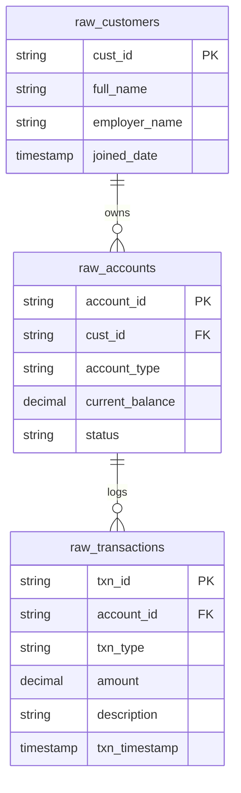

# 💳 Finance Banking: Retail Banking (Salary & Savings Accounts)

[🏠 Back to Home](../readme.md)

## 📌 Common List of IT Projects in Finance Banking

**Why**: Retail banking is the foundation of consumer finance. Managing millions of daily transactions, direct deposits (salaries), and bill payments requires immense scale, high availability, and strict consistency.
**What**: Building a Core Banking Data Platform to process daily transactions, generate customer statements, and provide personalized financial insights.
**How**: Leveraging Change Data Capture (CDC) to stream OLTP changes to a Data Lakehouse, using React for customer-facing web portals, and employing ML for Personal Finance Management (PFM).

### 🔄 High-Level Banking Architecture Flow


### 🧠 Finance IT Projects Mind Map (Retail Focus)


### 💳 Project: Retail Banking Data Platform (Salary Accounts)

#### ⚙️ IT Data Engineering Project
**Project Process Flow:**
1. Extract raw transactional data (deposits, withdrawals, transfers) from the Core Banking system using CDC (Kafka/Debezium).
2. Cleanse and enrich transactions with merchant/category data via Spark (Silver Layer).
3. Load into a Star Schema Data Warehouse for reporting and regulatory compliance (Gold Layer).

**Tasks & Objectives:**
- **Objective**: Provide a single source of truth for customer balances and transaction histories.
- **Tasks**: Implement Medallion Architecture, handle slowly changing dimensions (SCD Type 2) for customer profiles, and build daily aggregation pipelines for account balances.

**Source Data Model (OLTP / Raw Systems):**
- `raw_customers`: Customer demographic data.
- `raw_accounts`: Salary and savings account details.
- `raw_transactions`: Debits and credits (salary deposits, POS, ATM).

**Target Data Model (OLAP / Star Schema):**
- **Dimensions**: `dim_customer`, `dim_account`
- **Fact**: `fact_transactions`, `fact_daily_balances`

**Source Systems ER Diagram:**


**DDLs:**
```sql
-- =========================================
-- SOURCE TABLES (Bronze Layer / Raw Data)
-- =========================================
CREATE TABLE raw_customers (
    cust_id VARCHAR(50) PRIMARY KEY,
    full_name VARCHAR(100),
    employer_name VARCHAR(100),
    joined_date TIMESTAMP
);

CREATE TABLE raw_accounts (
    account_id VARCHAR(50) PRIMARY KEY,
    cust_id VARCHAR(50),
    account_type VARCHAR(50),
    current_balance DECIMAL(15, 2),
    status VARCHAR(20)
);

CREATE TABLE raw_transactions (
    txn_id VARCHAR(100) PRIMARY KEY,
    account_id VARCHAR(50),
    txn_type VARCHAR(20),
    amount DECIMAL(15, 2),
    description VARCHAR(255),
    txn_timestamp TIMESTAMP
);

-- =========================================
-- TARGET TABLES (Gold Layer / Star Schema)
-- =========================================
CREATE TABLE dim_customer (
    customer_sk INT AUTO_INCREMENT PRIMARY KEY,
    customer_id VARCHAR(50),
    full_name VARCHAR(100),
    employer_name VARCHAR(100),
    is_active BOOLEAN
);

CREATE TABLE dim_account (
    account_sk INT AUTO_INCREMENT PRIMARY KEY,
    account_id VARCHAR(50),
    customer_sk INT REFERENCES dim_customer(customer_sk),
    account_type VARCHAR(50)
);

CREATE TABLE fact_transactions (
    txn_id VARCHAR(100) PRIMARY KEY,
    account_sk INT REFERENCES dim_account(account_sk),
    txn_type VARCHAR(20),
    amount DECIMAL(15, 2),
    category VARCHAR(50),
    txn_date DATE
);
```

**Source Data Generators (Python):**
```python
import csv
import random
from faker import Faker
from datetime import datetime, timedelta

fake = Faker()

def generate_retail_data(num_cust=100, num_txns=2000):
    accounts = []
    
    with open('raw_customers.csv', mode='w', newline='') as f_cust, \
         open('raw_accounts.csv', mode='w', newline='') as f_acc:
        
        cust_writer = csv.writer(f_cust)
        acc_writer = csv.writer(f_acc)
        
        cust_writer.writerow(['cust_id', 'full_name', 'employer_name', 'joined_date'])
        acc_writer.writerow(['account_id', 'cust_id', 'account_type', 'current_balance', 'status'])
        
        for _ in range(num_cust):
            cust_id = fake.uuid4()
            acc_id = fake.bban()
            accounts.append(acc_id)
            
            employer = fake.company() if random.random() > 0.2 else 'Self-Employed'
            cust_writer.writerow([cust_id, fake.name(), employer, fake.date_time_this_decade().strftime('%Y-%m-%d')])
            acc_writer.writerow([acc_id, cust_id, random.choice(['Salary', 'Savings']), round(random.uniform(100, 15000), 2), 'ACTIVE'])

    with open('raw_transactions.csv', mode='w', newline='') as f_txn:
        txn_writer = csv.writer(f_txn)
        txn_writer.writerow(['txn_id', 'account_id', 'txn_type', 'amount', 'description', 'txn_timestamp'])
        
        for _ in range(num_txns):
            txn_id = fake.uuid4()
            acc_id = random.choice(accounts)
            
            # Simulate salary credits vs regular spending
            if random.random() > 0.85:
                txn_type = 'CREDIT'
                amount = round(random.uniform(2000, 8000), 2)
                desc = "SALARY DEPOSIT"
            else:
                txn_type = 'DEBIT'
                amount = round(random.uniform(5, 300), 2)
                desc = fake.company() + " POS"
                
            timestamp = fake.date_time_this_year()
            txn_writer.writerow([txn_id, acc_id, txn_type, amount, desc, timestamp.strftime('%Y-%m-%d %H:%M:%S')])

if __name__ == "__main__":
    generate_retail_data(50, 1000)
    print("Generated raw_customers.csv, raw_accounts.csv, and raw_transactions.csv successfully.")
```

#### 🌐 IT Web Development
**Project Process Flow:**
1. User logs into their mobile/web banking application (React Native / Angular).
2. App makes REST API calls to a microservice (Spring Boot / Node.js) to fetch account balances.
3. The frontend renders interactive charts (Chart.js) breaking down monthly expenses.

**Tasks & Objectives:**
- **Objective**: Deliver a seamless, secure, and fast digital banking experience.
- **Tasks**: Implement Multi-Factor Authentication (MFA), caching (Redis) for fast load times of recent transactions, and responsive design for mobile views.

#### 🤖 IT AI ML
**Tasks & Objectives:**
- **Objective**: Enhance the customer experience via Personal Finance Management (PFM).
- **Tasks**: Build an NLP-based text classifier to automatically categorize raw transaction descriptions (e.g., "STARBUCKS #123" -> "Coffee/Dining"). Train regression models to forecast the user's end-of-month balance and warn them of potential overdrafts.
