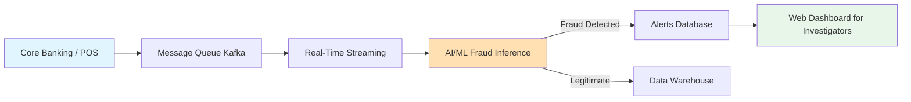
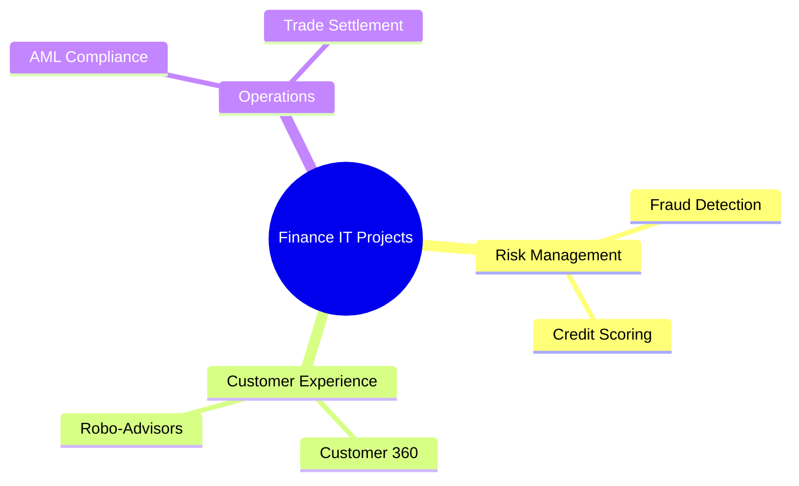
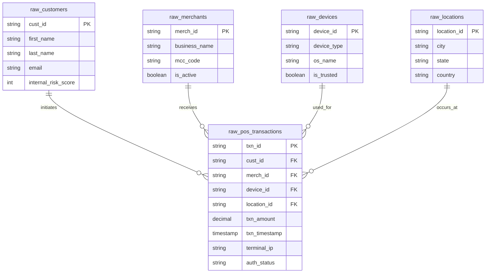
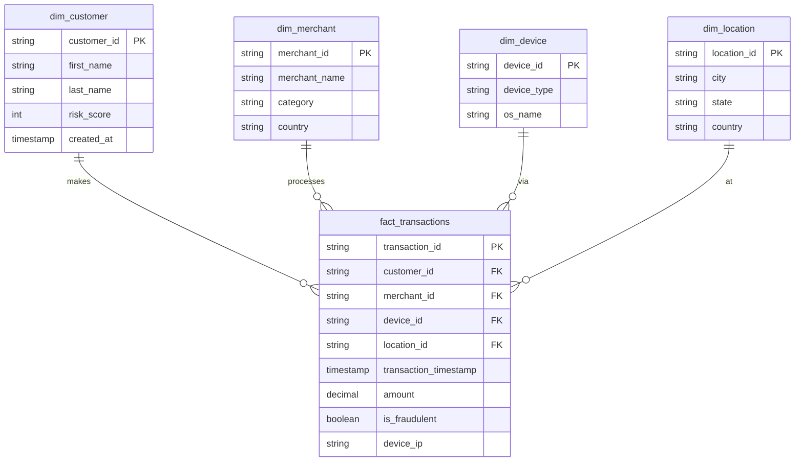

# 🏦 Finance Banking

[🏠 Back to Home](../readme.md)
## 📌 Common List of IT Projects in Finance Banking
* Write Up - Why, What, how  details
* MerMaid Process flow diagram and explanation
* MerMaid MindMap diagram and explanation

### 📌 Project Name
**Why**: Financial institutions face billions of dollars in losses annually due to fraudulent activities. Protecting customer assets and maintaining regulatory compliance is a top priority.
**What**: Implementing scalable IT solutions such as Real-Time Fraud Detection, Anti-Money Laundering (AML) monitoring, Customer 360, and Algorithmic Trading platforms.
**How**: By leveraging modern Data Engineering (streaming pipelines), Web Development (investigator dashboards), and AI/ML (anomaly detection models) to create end-to-end enterprise systems.

### 🔄 High-Level Banking Architecture Flow


### 🧠 Finance IT Projects Mind Map


### 🚨 Project: Credit Card Fraud Detection System

#### ⚙️ IT Data Engineering Project
* Explain Project Process Flow
* Explain tasks, objectives
* Generate Data Model
* Generate DDLs
* Create Data Generators (.py files)
**Project Process Flow:**
1. Ingest raw transaction data from Point of Sale (POS) systems via Kafka.
2. Process data in real-time using Apache Spark Streaming or Apache Flink.
3. Enrich streaming data with historical customer data (Silver layer).
4. Store curated data in a Data Warehouse (Gold layer) for BI and ML training.

**Tasks & Objectives:**
- **Objective**: Build a low-latency (<50ms) streaming pipeline to evaluate transactions before they are approved.
- **Tasks**: Set up Kafka topics, build streaming jobs, implement Medallion architecture (Bronze, Silver, Gold), and create automated data quality checks.

**Source Data Model (OLTP / Raw Systems):**
- `raw_customers`: Extracted from the Core Banking CRM.
- `raw_merchants`: Extracted from the Merchant Onboarding Portal.
- `raw_devices`: Extracted from the mobile/web application logs.
- `raw_locations`: Geospatial data mapped from POS terminals.
- `raw_pos_transactions`: Streaming events from the Point of Sale systems.

**Target Data Model (OLAP / Star Schema):**
- **Dimensions**: `dim_customer`, `dim_merchant`, `dim_device`, `dim_location` (Silver/Gold layer enriched data)
- **Fact**: `fact_transactions` (Gold layer curated transactions)

**Source Systems ER Diagram:**


**Target Data Warehouse ER Diagram:**


**DDLs:**
```sql
CREATE TABLE dim_customer (
    customer_id VARCHAR(50) PRIMARY KEY,
    first_name VARCHAR(50),
    last_name VARCHAR(50),
    risk_score INT,
    created_at TIMESTAMP
);

CREATE TABLE dim_merchant (
    merchant_id VARCHAR(50) PRIMARY KEY,
    merchant_name VARCHAR(100),
    category VARCHAR(50),
    country VARCHAR(2)
);

CREATE TABLE dim_device (
    device_id VARCHAR(50) PRIMARY KEY,
    device_type VARCHAR(50),
    os_name VARCHAR(50)
);

CREATE TABLE dim_location (
    location_id VARCHAR(50) PRIMARY KEY,
    city VARCHAR(100),
    state VARCHAR(50),
    country VARCHAR(50)
);

CREATE TABLE fact_transactions (
    transaction_id VARCHAR(100) PRIMARY KEY,
    customer_id VARCHAR(50) REFERENCES dim_customer(customer_id),
    merchant_id VARCHAR(50) REFERENCES dim_merchant(merchant_id),
    device_id VARCHAR(50) REFERENCES dim_device(device_id),
    location_id VARCHAR(50) REFERENCES dim_location(location_id),
    transaction_timestamp TIMESTAMP,
    amount DECIMAL(10, 2),
    is_fraudulent BOOLEAN,
    device_ip VARCHAR(15)
);
```

**Data Generators (Python):**
```python
import csv
import random
from faker import Faker
from datetime import datetime, timedelta

fake = Faker()

def generate_transactions(num_records=1000):
    # Pre-generate some customers and merchants
    customers = [fake.uuid4() for _ in range(50)]
    merchants = [fake.uuid4() for _ in range(20)]
    
    with open('transactions.csv', mode='w', newline='') as file:
        writer = csv.writer(file)
        writer.writerow(['transaction_id', 'customer_id', 'merchant_id', 'transaction_timestamp', 'amount', 'is_fraudulent'])
        
        for _ in range(num_records):
            txn_id = fake.uuid4()
            cust_id = random.choice(customers)
            merch_id = random.choice(merchants)
            timestamp = datetime.now() - timedelta(minutes=random.randint(1, 10000))
            amount = round(random.uniform(1.0, 5000.0), 2)
            # Artificially spike fraud on large amounts for the dummy dataset
            is_fraud = random.choice([True, False]) if amount > 3000 else False
            
            writer.writerow([txn_id, cust_id, merch_id, timestamp.strftime('%Y-%m-%d %H:%M:%S'), amount, is_fraud])

if __name__ == "__main__":
    generate_transactions(500)
    print("Generated 500 records in transactions.csv successfully.")
```

#### 🌐 IT Web Development
* Explain Project Process Flow
* Explain tasks, objectives
**Project Process Flow:**
1. Investigator logs into the secure web portal (React.js / Vue.js).
2. Dashboard fetches real-time fraud alerts from the backend API (Node.js / Python FastAPI).
3. Investigator reviews transaction details, customer history, and ML explainability scores.
4. Investigator clicks "Block Card" or "Dismiss Alert", triggering an API call back to the core banking system.

**Tasks & Objectives:**
- **Objective**: Provide a low-latency, highly secure dashboard for fraud analysts to review flagged transactions.
- **Tasks**: 
  - Build a responsive UI with charts (Recharts/D3) showing customer spending patterns.
  - Implement Role-Based Access Control (RBAC) and OAuth2 for strict banking security compliance.
  - Create REST/GraphQL APIs to interface with the Data Warehouse and Alert queues.

#### 🤖 IT AI ML
* Explain Project Process Flow
* Explain tasks, objectives
**Project Process Flow:**
1. Extract historical transaction data from the Data Warehouse.
2. Perform Feature Engineering (e.g., transaction frequency in the last 24h, distance between consecutive transactions).
3. Train classification models (XGBoost, Random Forest, or Neural Networks) to predict `is_fraudulent`.
4. Deploy the model as a microservice (Docker/Kubernetes) or via a Model Registry (MLflow) for real-time inference by the Data Engineering streaming pipeline.

**Tasks & Objectives:**
- **Objective**: Accurately detect fraudulent transactions while minimizing false positives (which cause friction for legitimate customers).
- **Tasks**: 
  - Handle highly imbalanced datasets using techniques like SMOTE or custom loss functions.
  - Monitor model drift in production and set up automated retraining pipelines.
  - Implement SHAP values to explain to investigators *why* a specific transaction was flagged (e.g., "Location mismatch").

