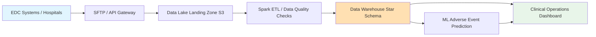
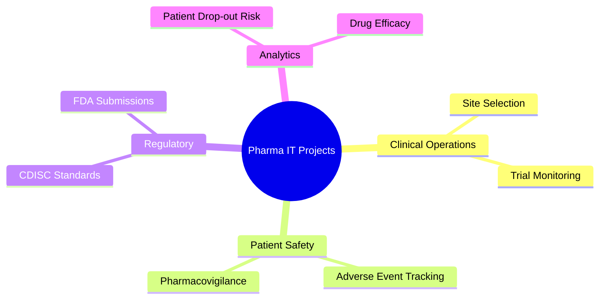
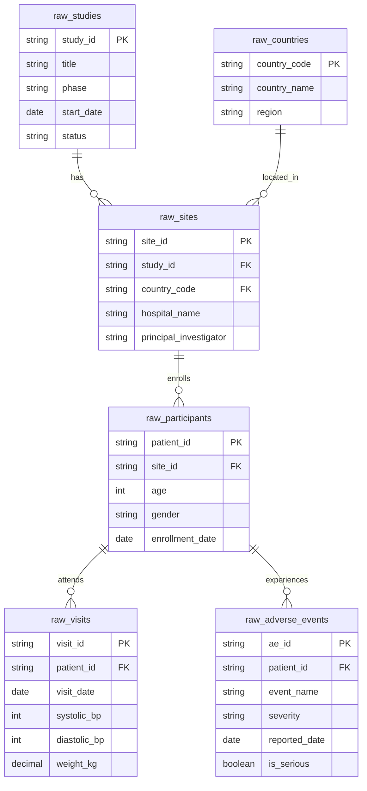
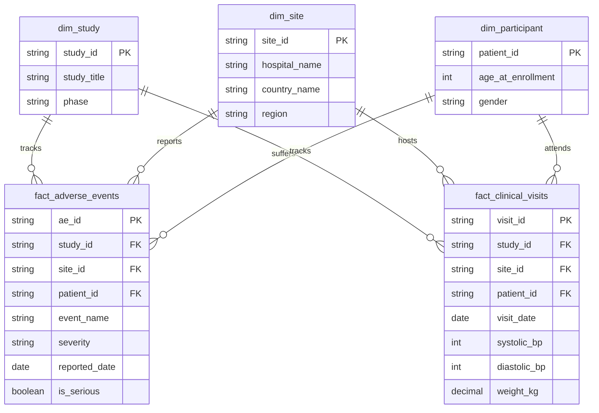

# 🧪 Pharma & Life Sciences: Clinical Trials

[🏠 Back to Home](../readme.md)

## 📌 Common List of IT Projects in Pharma

**Why**: Clinical trials are incredibly expensive and strictly regulated by agencies like the FDA and EMA. Ensuring patient safety, maintaining data integrity, and accelerating the time-to-market for life-saving drugs are top priorities for pharmaceutical companies.
**What**: Building a Clinical Data Repository (CDR) to aggregate Electronic Data Capture (EDC) systems, monitor adverse events (AE), and track patient drop-out risks across global study sites.
**How**: Using robust Data Engineering pipelines to ingest highly nested healthcare data, Web Portals for Principal Investigators to review safety signals, and ML models to predict patient retention and trial outcomes.

### 🔄 High-Level Pharma Architecture Flow


### 🧠 Pharma IT Projects Mind Map


### 🧪 Project: Clinical Trials Safety & Monitoring Platform

#### ⚙️ IT Data Engineering Project
**Project Process Flow:**
1. Ingest raw clinical data from disparate hospital Electronic Data Capture (EDC) systems globally.
2. Cleanse and standardize data into CDISC (Clinical Data Interchange Standards Consortium) compliant formats using Apache Spark.
3. Load the data into a target Star Schema to allow biostatisticians and medical monitors to easily slice data by study, site, and patient demographics.

**Tasks & Objectives:**
- **Objective**: Create a unified, auditable repository for all clinical trial data to support real-time safety monitoring and regulatory submissions.
- **Tasks**: Build batch ETL pipelines, handle complex hierarchical healthcare data, and implement strict PHI (Protected Health Information) masking/encryption.

**Source Data Model (OLTP / EDC Systems):**
- `raw_studies`: Global clinical trials being conducted.
- `raw_countries`: Lookup for global regions.
- `raw_sites`: Hospitals and clinics administering the trials.
- `raw_participants`: Enrolled patients (anonymized).
- `raw_visits`: Routine clinical check-ups and vital signs.
- `raw_adverse_events`: Side effects or safety incidents reported by participants.

**Target Data Model (OLAP / Star Schema):**
- **Dimensions**: `dim_study`, `dim_site` (includes country), `dim_participant`
- **Facts**: `fact_adverse_events`, `fact_clinical_visits`

**Source Systems ER Diagram:**


**Target Data Warehouse ER Diagram:**


**DDLs:**
```sql
-- =========================================
-- SOURCE TABLES (Bronze Layer / Raw EDC Data)
-- =========================================
CREATE TABLE raw_studies (
    study_id VARCHAR(50) PRIMARY KEY,
    title VARCHAR(200),
    phase VARCHAR(20),
    start_date DATE,
    status VARCHAR(50)
);

CREATE TABLE raw_countries (
    country_code VARCHAR(10) PRIMARY KEY,
    country_name VARCHAR(100),
    region VARCHAR(50)
);

CREATE TABLE raw_sites (
    site_id VARCHAR(50) PRIMARY KEY,
    study_id VARCHAR(50),
    country_code VARCHAR(10),
    hospital_name VARCHAR(150),
    principal_investigator VARCHAR(100)
);

CREATE TABLE raw_participants (
    patient_id VARCHAR(50) PRIMARY KEY,
    site_id VARCHAR(50),
    age INT,
    gender VARCHAR(20),
    enrollment_date DATE
);

CREATE TABLE raw_visits (
    visit_id VARCHAR(50) PRIMARY KEY,
    patient_id VARCHAR(50),
    visit_date DATE,
    systolic_bp INT,
    diastolic_bp INT,
    weight_kg DECIMAL(5, 2)
);

CREATE TABLE raw_adverse_events (
    ae_id VARCHAR(50) PRIMARY KEY,
    patient_id VARCHAR(50),
    event_name VARCHAR(100),
    severity VARCHAR(20),
    reported_date DATE,
    is_serious BOOLEAN
);
```

**Source Data Generators (Python):**
```python
import csv
import random
from faker import Faker
from datetime import datetime, timedelta

fake = Faker()

def generate_clinical_data(num_studies=5, num_sites=30, num_patients=500):
    studies = [f"STUDY-{1000+i}" for i in range(num_studies)]
    countries = [("US", "United States", "North America"), ("GB", "United Kingdom", "Europe"), 
                 ("DE", "Germany", "Europe"), ("JP", "Japan", "Asia"), ("IN", "India", "Asia")]
    
    # 1. raw_studies.csv
    with open('raw_studies.csv', mode='w', newline='') as f:
        writer = csv.writer(f)
        writer.writerow(['study_id', 'title', 'phase', 'start_date', 'status'])
        for s_id in studies:
            writer.writerow([s_id, fake.catch_phrase() + " Treatment", random.choice(["Phase I", "Phase II", "Phase III"]), fake.date_between(start_date='-3y', end_date='-1y'), "Active"])

    # 2. raw_countries.csv
    with open('raw_countries.csv', mode='w', newline='') as f:
        writer = csv.writer(f)
        writer.writerow(['country_code', 'country_name', 'region'])
        writer.writerows(countries)

    # 3. raw_sites.csv
    sites = []
    with open('raw_sites.csv', mode='w', newline='') as f:
        writer = csv.writer(f)
        writer.writerow(['site_id', 'study_id', 'country_code', 'hospital_name', 'principal_investigator'])
        for _ in range(num_sites):
            site_id = f"SITE-{fake.unique.random_int(min=100, max=999)}"
            sites.append(site_id)
            writer.writerow([site_id, random.choice(studies), random.choice(countries)[0], fake.company() + " Hospital", "Dr. " + fake.name()])

    # 4. raw_participants.csv
    patients = []
    with open('raw_participants.csv', mode='w', newline='') as f:
        writer = csv.writer(f)
        writer.writerow(['patient_id', 'site_id', 'age', 'gender', 'enrollment_date'])
        for _ in range(num_patients):
            p_id = f"PT-{fake.unique.random_int(min=10000, max=99999)}"
            patients.append(p_id)
            writer.writerow([p_id, random.choice(sites), random.randint(18, 85), random.choice(["Male", "Female"]), fake.date_between(start_date='-1y', end_date='today')])

    # 5. raw_visits.csv & 6. raw_adverse_events.csv
    with open('raw_visits.csv', mode='w', newline='') as f_vis, open('raw_adverse_events.csv', mode='w', newline='') as f_ae:
        vis_writer = csv.writer(f_vis)
        ae_writer = csv.writer(f_ae)
        
        vis_writer.writerow(['visit_id', 'patient_id', 'visit_date', 'systolic_bp', 'diastolic_bp', 'weight_kg'])
        ae_writer.writerow(['ae_id', 'patient_id', 'event_name', 'severity', 'reported_date', 'is_serious'])
        
        for p_id in patients:
            # Generate 1 to 5 visits per patient
            for _ in range(random.randint(1, 5)):
                vis_writer.writerow([fake.uuid4(), p_id, fake.date_between(start_date='-1y', end_date='today'), 
                                     random.randint(110, 160), random.randint(70, 100), round(random.uniform(50.0, 120.0), 2)])
            
            # 20% chance a patient has an adverse event
            if random.random() > 0.8:
                ae_events = ["Headache", "Nausea", "Fatigue", "Dizziness", "Elevated Liver Enzymes", "Cardiac Arrhythmia"]
                event = random.choice(ae_events)
                severity = random.choice(["Mild", "Moderate", "Severe"])
                is_serious = True if severity == "Severe" else False
                ae_writer.writerow([fake.uuid4(), p_id, event, severity, fake.date_between(start_date='-1y', end_date='today'), is_serious])

if __name__ == "__main__":
    generate_clinical_data()
    print("Generated 6 raw clinical data CSV files successfully.")
```

#### 🌐 IT Web Development
**Project Process Flow:**
1. A Medical Monitor logs into the Clinical Operations Portal (React / TypeScript).
2. The dashboard displays global trial progress, highlighting sites with poor enrollment or high adverse event rates.
3. The monitor drills down into a specific patient's medical profile to review Severe Adverse Events (SAEs).
4. The portal integrates with a pharmacovigilance regulatory API to submit mandatory safety reports to the FDA/EMA.

**Tasks & Objectives:**
- **Objective**: Provide clinical operations teams with a centralized, near-real-time view of study safety and efficacy.
- **Tasks**: Implement strict data masking so Personally Identifiable Information (PHI) is not exposed to unauthorized users. Create dynamic charting using D3.js or Recharts to map patient vital sign trends over time.

#### 🤖 IT AI ML
**Tasks & Objectives:**
- **Objective**: Improve patient safety and trial retention rates.
- **Tasks**: 
  - **Adverse Event Prediction**: Train classification models on historical biomarker and demographic data to identify patients at high risk of developing severe side effects before they happen.
  - **Patient Drop-out Risk**: Use survival analysis (e.g., Kaplan-Meier curves, Cox Proportional Hazards) or machine learning to predict which participants are likely to abandon the trial prematurely, allowing site coordinators to intervene with better patient support.
