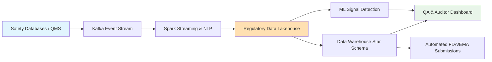
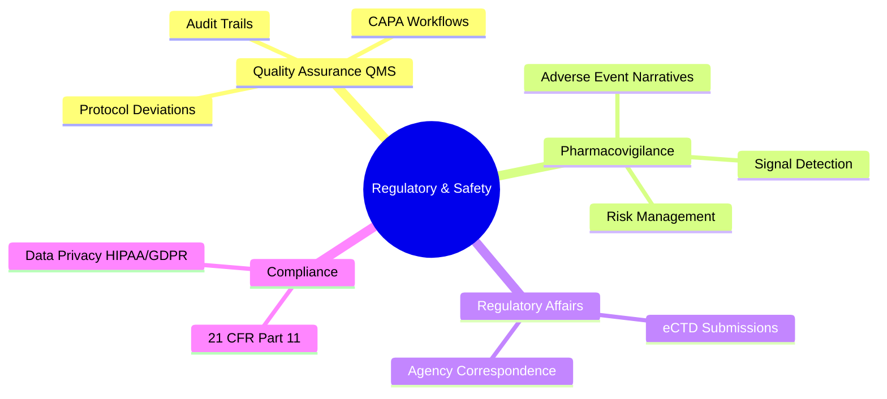
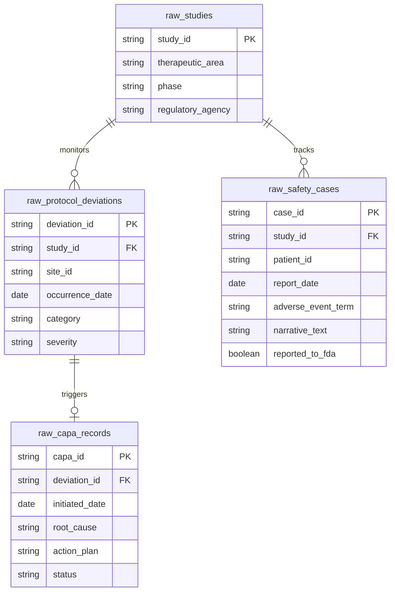

# ⚕️ Pharma & Life Sciences: Regulatory, Quality, and Safety

[🏠 Back to Home](../readme.md)

## 📌 Common List of IT Projects in Pharma

**Why**: Pharmaceutical companies operate in highly regulated environments (FDA, EMA). Non-compliance, missing safety signals, or poor quality control at clinical sites can result in billion-dollar fines, trial holds, or rejection of new drug applications.
**What**: Building a centralized Quality Management System (QMS) and Pharmacovigilance Data Lake to track Individual Case Safety Reports (ICSRs), protocol deviations, and Corrective and Preventive Actions (CAPA).
**How**: Leveraging ETL pipelines to aggregate structured logs and unstructured medical narratives, building Web Portals for Quality Assurance (QA) auditors, and using Natural Language Processing (NLP) to detect early safety signals.

### 📋 High-Level Pharma Regulatory Architecture Flow


### 📋 Regulatory & Safety Mind Map


### 📋 Project: Pharmacovigilance and Quality Compliance Platform

#### ⚙️ IT Data Engineering Project
**Project Process Flow:**
1. Extract raw safety cases, site deviation logs, and CAPA records from distinct Quality Management and Safety systems.
2. Transform the data, specifically running NLP over unstructured doctor narratives to extract standardized MedDRA (Medical Dictionary for Regulatory Activities) terms.
3. Load the curated data into a Star Schema optimized for regulatory reporting and auditor queries.

**Tasks & Objectives:**
- **Objective**: Ensure 100% traceability of quality events and safety reports from inception to regulatory submission.
- **Tasks**: Implement Slowly Changing Dimensions (SCD Type 2) to maintain audit histories of document changes, and build automated data quality checks to flag incomplete safety reports.

**Source Data Model (OLTP / QMS & Safety Systems):**
- `raw_studies`: Active clinical trials.
- `raw_safety_cases`: Patient safety incident narratives (ICSRs).
- `raw_protocol_deviations`: Instances where clinical sites failed to follow the trial protocol.
- `raw_capa_records`: Corrective and Preventive Actions taken to fix quality issues.

**Target Data Model (OLAP / Star Schema):**
- **Dimensions**: `dim_study`, `dim_site`, `dim_event_type`
- **Facts**: `fact_quality_events` (combines deviations and CAPAs), `fact_safety_reports`

**Source Systems ER Diagram:**


**DDLs:**
```sql
-- =========================================
-- SOURCE TABLES (Bronze Layer / Raw Data)
-- =========================================
CREATE TABLE raw_studies (
    study_id VARCHAR(50) PRIMARY KEY,
    therapeutic_area VARCHAR(100),
    phase VARCHAR(20),
    regulatory_agency VARCHAR(50)
);

CREATE TABLE raw_safety_cases (
    case_id VARCHAR(50) PRIMARY KEY,
    study_id VARCHAR(50),
    patient_id VARCHAR(50),
    report_date DATE,
    adverse_event_term VARCHAR(100),
    narrative_text TEXT,
    reported_to_fda BOOLEAN
);

CREATE TABLE raw_protocol_deviations (
    deviation_id VARCHAR(50) PRIMARY KEY,
    study_id VARCHAR(50),
    site_id VARCHAR(50),
    occurrence_date DATE,
    category VARCHAR(100),
    severity VARCHAR(20)
);

CREATE TABLE raw_capa_records (
    capa_id VARCHAR(50) PRIMARY KEY,
    deviation_id VARCHAR(50),
    initiated_date DATE,
    root_cause TEXT,
    action_plan TEXT,
    status VARCHAR(50)
);

-- =========================================
-- TARGET TABLES (Gold Layer / Star Schema)
-- =========================================
CREATE TABLE dim_study (
    study_sk INT AUTO_INCREMENT PRIMARY KEY,
    study_id VARCHAR(50),
    therapeutic_area VARCHAR(100),
    phase VARCHAR(20)
);

CREATE TABLE dim_event_type (
    event_type_sk INT AUTO_INCREMENT PRIMARY KEY,
    event_category VARCHAR(50),
    severity_level VARCHAR(20),
    is_regulatory_reportable BOOLEAN
);

CREATE TABLE fact_quality_events (
    event_id VARCHAR(50) PRIMARY KEY,
    study_sk INT REFERENCES dim_study(study_sk),
    event_type_sk INT REFERENCES dim_event_type(event_type_sk),
    site_id VARCHAR(50),
    occurrence_date DATE,
    has_capa BOOLEAN,
    capa_status VARCHAR(50)
);
```

**Source Data Generators (Python):**
```python
import csv
import random
from faker import Faker
from datetime import datetime, timedelta

fake = Faker()

def generate_regulatory_data(num_studies=10, num_safety_cases=500, num_deviations=200):
    studies = [f"ONCO-{1000+i}" if i < 5 else f"CARDIO-{2000+i}" for i in range(num_studies)]
    
    # 1. raw_studies.csv
    with open('raw_studies.csv', mode='w', newline='') as f:
        writer = csv.writer(f)
        writer.writerow(['study_id', 'therapeutic_area', 'phase', 'regulatory_agency'])
        for s_id in studies:
            area = "Oncology" if "ONCO" in s_id else "Cardiology"
            writer.writerow([s_id, area, random.choice(["Phase II", "Phase III"]), random.choice(["FDA", "EMA", "PMDA"])])

    # 2. raw_safety_cases.csv
    with open('raw_safety_cases.csv', mode='w', newline='') as f:
        writer = csv.writer(f)
        writer.writerow(['case_id', 'study_id', 'patient_id', 'report_date', 'adverse_event_term', 'narrative_text', 'reported_to_fda'])
        
        ae_terms = ["Myocardial Infarction", "Severe Nausea", "Neutropenia", "Hepatotoxicity", "Syncope"]
        for _ in range(num_safety_cases):
            case_id = f"SAF-{fake.unique.random_int(min=10000, max=99999)}"
            term = random.choice(ae_terms)
            narrative = f"Patient presented with {term.lower()} 3 days post-dose. Condition was managed with standard care."
            is_fda = True if term in ["Myocardial Infarction", "Hepatotoxicity"] else random.choice([True, False])
            
            writer.writerow([case_id, random.choice(studies), f"PT-{random.randint(100, 900)}", fake.date_this_year(), term, narrative, is_fda])

    # 3. raw_protocol_deviations.csv & 4. raw_capa_records.csv
    deviations = []
    with open('raw_protocol_deviations.csv', mode='w', newline='') as f_dev, \
         open('raw_capa_records.csv', mode='w', newline='') as f_capa:
        
        dev_writer = csv.writer(f_dev)
        capa_writer = csv.writer(f_capa)
        
        dev_writer.writerow(['deviation_id', 'study_id', 'site_id', 'occurrence_date', 'category', 'severity'])
        capa_writer.writerow(['capa_id', 'deviation_id', 'initiated_date', 'root_cause', 'action_plan', 'status'])
        
        categories = ["Missed Visit", "Informed Consent Error", "Dosing Error", "Lab Sample Mishandling"]
        
        for _ in range(num_deviations):
            dev_id = f"DEV-{fake.unique.random_int(min=1000, max=9999)}"
            dev_date = fake.date_between(start_date='-2y', end_date='today')
            severity = random.choice(["Minor", "Major", "Critical"])
            
            dev_writer.writerow([dev_id, random.choice(studies), f"SITE-{random.randint(10, 50)}", dev_date, random.choice(categories), severity])
            
            # Trigger CAPA for all Major/Critical deviations and some Minor ones
            if severity in ["Major", "Critical"] or random.random() > 0.8:
                capa_id = f"CAPA-{fake.unique.random_int(min=100, max=999)}"
                capa_date = dev_date + timedelta(days=random.randint(1, 14))
                status = random.choice(["Open", "Under Review", "Implemented", "Closed"])
                
                capa_writer.writerow([capa_id, dev_id, capa_date, "Inadequate staff training.", "Conduct mandatory re-training for all site staff.", status])

if __name__ == "__main__":
    generate_regulatory_data()
    print("Generated raw_studies.csv, raw_safety_cases.csv, raw_protocol_deviations.csv, and raw_capa_records.csv successfully.")
```

#### 🌐 IT Web Development
**Project Process Flow:**
1. QA Auditor logs into the Compliance Management Portal (Angular / Node.js).
2. The portal presents a dashboard of Open CAPAs approaching their regulatory deadlines.
3. The auditor opens a specific Protocol Deviation, reviews the attached evidence, and digitally signs off on the CAPA action plan (triggering a 21 CFR Part 11 compliant audit trail log).
4. The system automatically generates a PDF regulatory report.

**Tasks & Objectives:**
- **Objective**: Digitize and streamline the QA process to ensure audit-readiness at all times.
- **Tasks**: Implement strict Role-Based Access Control (RBAC), e-Signatures with timestamping, and generate complex, paginated reports (e.g., using Puppeteer or JasperReports) for regulatory bodies.

#### 🤖 IT AI ML
**Tasks & Objectives:**
- **Objective**: Proactively identify systemic quality failures and unearth hidden safety signals.
- **Tasks**: 
  - **NLP for Signal Detection**: Use Large Language Models (LLMs) or Named Entity Recognition (NER) to scan unstructured `narrative_text` in safety reports. Identify new side-effect patterns (signals) that haven't been formally categorized yet.
  - **Site Risk Scoring**: Train anomaly detection models to flag clinical sites that have an unusually high rate of protocol deviations compared to the global average, recommending them for immediate QA audits.
