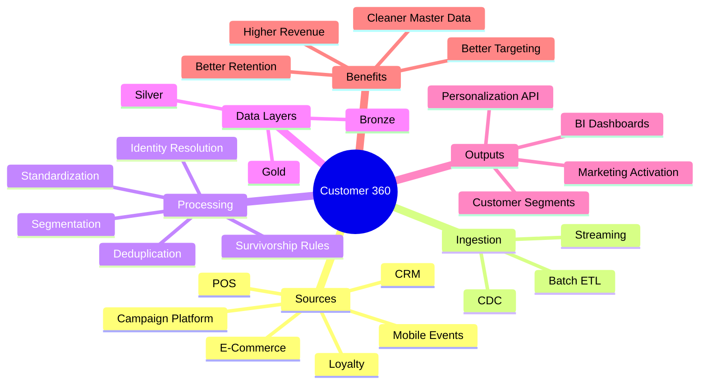
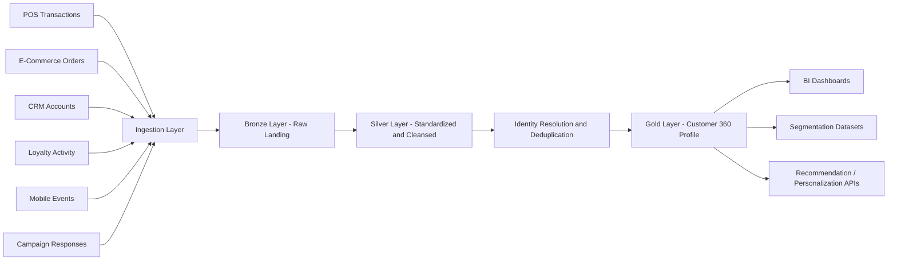
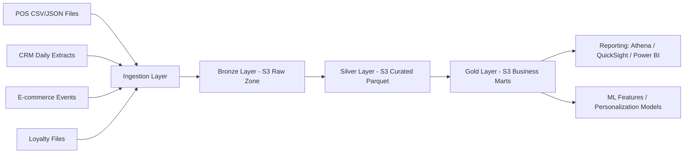
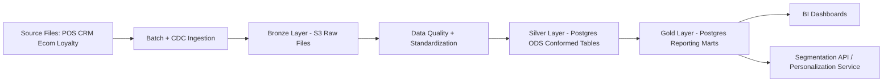
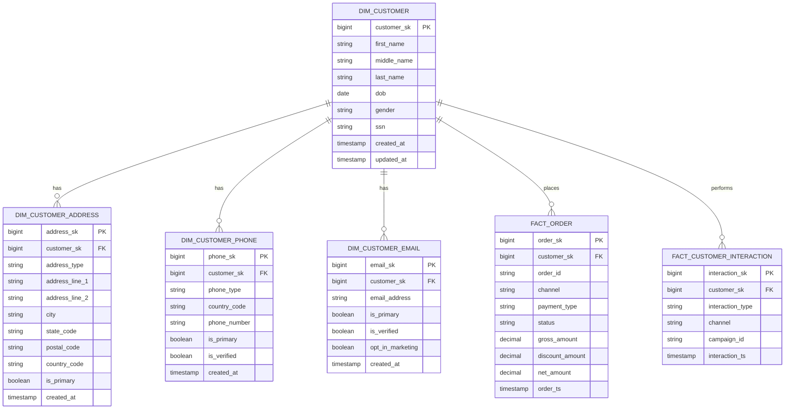

# 🧩 Customer 360 & Personalization Platform

[🏠 Back to Home](../../readme.md)
## 📌 Project Name
Customer 360 & Personalization Platform

## 💡 Explanation - What, Why, How

### 💡 What
A unified retail customer data platform that consolidates customer records, purchases, digital interactions, loyalty activity, and campaign touchpoints into a trusted 360-degree profile.

### 💡 Why
Retail businesses typically have customer data spread across POS, e-commerce, CRM, loyalty, and mobile systems. That fragmentation makes it difficult to:
- personalize offers
- measure customer lifetime value
- identify churn risk
- build reliable segments
- support omnichannel analytics

### 💡 How
The solution ingests raw data from operational systems into a Bronze layer, standardizes and deduplicates it in Silver, and creates conformed customer profile and segmentation datasets in Gold for analytics, dashboards, and personalization APIs.

---

## 🧠 Mermaid Mind Map

---

## ⚙️ Data Engineering

### 🔄 Explain Project Process Flow

### 🔄 Architecture Option 1: Data Lake Project (S3 Bronze/Silver/Gold)

### 🔄 Architecture Option 2: Data Lake + Data Warehouse (Postgres)

### ✅ Explain Tasks, Objectives

#### ✅ Tasks
- ingest customer records from multiple source systems
- standardize identifiers such as email, phone, loyalty ID, and device ID
- deduplicate overlapping records using matching rules
- assign a master customer key
- enrich profile with transactional and behavioral metrics
- create reusable segmentation datasets
- publish curated tables for analytics and activation platforms

#### ✅ Objectives
- deliver one trusted customer profile per individual
- improve campaign targeting and personalization
- enable churn and loyalty analytics
- support omnichannel customer reporting
- reduce manual data reconciliation effort

### 💡 How To Get The Correct Customer And Remove Duplicates
The identity-resolution process is designed to ensure one `customer_sk` maps to one real individual, even when source records conflict.

1. Standardize all matching attributes:
Normalize names, lowercase emails, strip phone punctuation, standardize address components, and validate DOB.
2. Candidate blocking:
Generate candidate groups using keys such as `email`, `phone + last_name`, `dob + zip + last_name`.
3. Deterministic matching:
Auto-link records when strong identifiers match exactly (SSN, verified email, verified phone, loyalty ID).
4. Probabilistic matching:
When strong IDs are missing, compute weighted similarity across name, DOB, address, phone, and email.
5. Thresholding and decisioning:
`>= 0.95` auto-merge, `0.80-0.94` steward review queue, `< 0.80` keep as separate profiles.
6. Survivorship rules:
For golden record attributes, prefer most recent verified values and apply source precedence (CRM > POS > Web).
7. Merge lineage and auditability:
Persist `source_customer_id`, `matched_customer_sk`, `match_rule`, `match_score`, `merge_ts` for traceability.
8. Re-duplication prevention:
Use canonicalized unique keys and idempotent upsert logic in Silver and Gold loads.

### ✅ Recommended Dedup Rules
- Exact Rule 1: same SSN -> same customer.
- Exact Rule 2: same verified email -> same customer.
- Exact Rule 3: same verified phone + same DOB -> same customer.
- Fuzzy Rule 1: same `last_name + dob + zip` with high first-name similarity.
- Fuzzy Rule 2: similar address + phone + nickname-aware name match.
- Manual Rule: unresolved high-risk collisions sent to data steward queue.

### 🧱 SQL Example: Duplicate Email Detection
[Customer 360 SQL Pack](customer_360_sql.md)

---

## 🗃️ Generate Data Model

---

## 🧱 Generate DDLs

[Customer 360 SQL Pack](customer_360_sql.md)

---

## 🧪 Create Data Generators (.py files)
[Customer 360 Data Generators](customer_360_data_generators.md)

---

## 📌 Suggested dbt Modeling Approach

[Customer 360 SQL Pack](customer_360_sql.md)

---

## 🎯 Interview and Resume
[Customer 360 Interview Questions and Resume Bullets](customer_360_interview_resume.md)

---

## ✅ Assignments
[Customer 360 Detailed Assignment Solutions](customer_360_assignment_detailed_solutions.md)  
[Customer 360 Mapping Solution](customer_360_mapping_solution.md)

---

## 📘 MCQ
[Customer 360 MCQ Bank](customer_360_mcq_bank.md)

