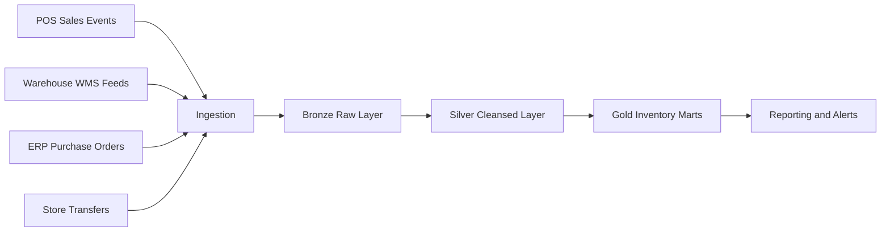

# 📦 Inventory Management System

[🏠 Back to Home](../../readme.md)

## 💡 Explanation - What, Why, How
**What:** A retail inventory platform that tracks stock across stores and warehouses in near real time, including on-hand, reserved, in-transit, and safety stock quantities.  
**Why:** Inventory is often fragmented across POS, WMS, and ERP systems, which leads to stockouts, overstock, and inaccurate replenishment.  
**How:** Ingest source events, standardize and validate data, maintain conformed inventory tables, and publish reporting marts for operational dashboards and replenishment decisions.

## ⚙️ Data Engineering

### 🔄 Process Flow

### ✅ Core Objectives
- Maintain accurate inventory by location and product.
- Separate store stock vs warehouse stock visibility.
- Track inventory movements (sale, return, transfer, receiving, adjustment).
- Enable reorder alerts and replenishment planning.

### 🗃️ Data Model (Key Tables)
- `dim_product`
- `dim_store`
- `dim_warehouse`
- `store_inventory`
- `warehouse_inventory`
- `inventory_movement`
- `purchase_order`
- `purchase_order_line`
- `stock_transfer`
- `stock_transfer_line`

### 🧱 SQL
[Inventory SQL Pack](inventory_sql.md)

### 🧪 Data Generators
[Inventory Data Generators](inventory_data_generators.md)

---

## 🎯 Interview and Resume
[Inventory Interview Questions and Resume Bullets](inventory_interview_resume.md)

---

## ✅ Assignments
[Inventory Detailed Assignment Solutions](inventory_assignment_detailed_solutions.md)  
[Inventory Mapping Solution](inventory_mapping_solution.md)

---

## 📘 MCQ
[Inventory MCQ Bank](inventory_mcq_bank.md)

