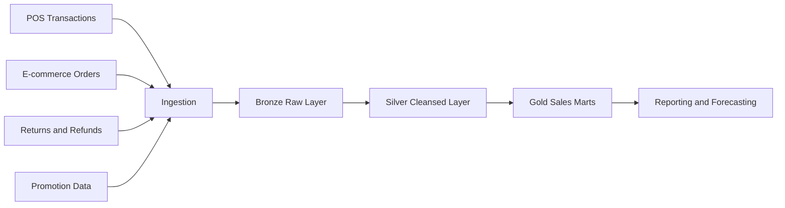

# 📈 Sales Analytics Platform

[🏠 Back to Home](../../readme.md)

## 💡 Explanation - What, Why, How
**What:** A retail sales analytics platform that unifies transaction, product, store, channel, and promotion data into trusted reporting datasets.  
**Why:** Sales data is often split across POS, e-commerce, and ERP systems, making performance analysis inconsistent and slow.  
**How:** Ingest source feeds into Bronze, standardize and reconcile in Silver, and publish Gold marts for KPIs, forecasting inputs, and business dashboards.

## ⚙️ Data Engineering

### 🔄 Process Flow

### ✅ Core Objectives
- Produce one trusted sales view across channels.
- Track gross, discount, net, tax, and margin metrics.
- Support store-level and SKU-level performance reporting.
- Enable trend, basket, and promotion impact analysis.

### 🗃️ Data Model (Key Tables)
- `dim_date`
- `dim_product`
- `dim_store`
- `dim_channel`
- `fact_sales`
- `fact_returns`
- `fact_promotion_redemption`
- `fact_sales_target`

### 🧱 SQL
[Sales SQL Pack](sales_sql.md)

### 🧪 Data Generators
[Sales Data Generators](sales_data_generators.md)

---

## 🎯 Interview and Resume
[Sales Interview Questions and Resume Bullets](sales_interview_resume.md)

---

## ✅ Assignments
[Sales Detailed Assignment Solutions](sales_assignment_detailed_solutions.md)  
[Sales Mapping Solution](sales_mapping_solution.md)

---

## 📘 MCQ
[Sales MCQ Bank](sales_mcq_bank.md)

