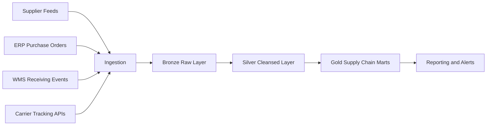

# 🚚 Supply Chain Platform

[🏠 Back to Home](../../readme.md)

## 💡 Explanation - What, Why, How
**What:** A supply chain data platform that tracks suppliers, purchase orders, shipments, receiving, and fulfillment across warehouses and stores.  
**Why:** Supply chain data is often distributed across ERP, WMS, and logistics providers, causing delayed visibility, late shipments, and planning inefficiencies.  
**How:** Ingest source events into Bronze, standardize and reconcile in Silver, and publish Gold marts for logistics performance, vendor scorecards, and ETA analytics.

## ⚙️ Data Engineering

### 🔄 Process Flow

### ✅ Core Objectives
- Track end-to-end order-to-delivery lifecycle.
- Monitor supplier performance and shipment delays.
- Improve receiving accuracy and fulfillment speed.
- Enable proactive exception management (late, partial, damaged).

### 🗃️ Data Model (Key Tables)
- `dim_supplier`
- `dim_carrier`
- `dim_warehouse`
- `purchase_order`
- `purchase_order_line`
- `shipment`
- `shipment_line`
- `receiving_event`
- `fact_supply_chain_kpi`

### 🧱 SQL
[Supply Chain SQL Pack](supply_chain_sql.md)
[Supply Chain SQL DDL File](supply_chain_sql.sql)

### 🧪 Data Generators
[Supply Chain Data Generators](supply_chain_data_generators.md)

---

## 🎯 Interview and Resume
[Supply Chain Interview Questions and Resume Bullets](supply_chain_interview_resume.md)

---

## ✅ Assignments
[Supply Chain Detailed Assignment Solutions](supply_chain_assignment_detailed_solutions.md)  
[Supply Chain Mapping Solution](supply_chain_mapping_solution.md)

---

## 📘 MCQ
[Supply Chain MCQ Bank](supply_chain_mcq_bank.md)

